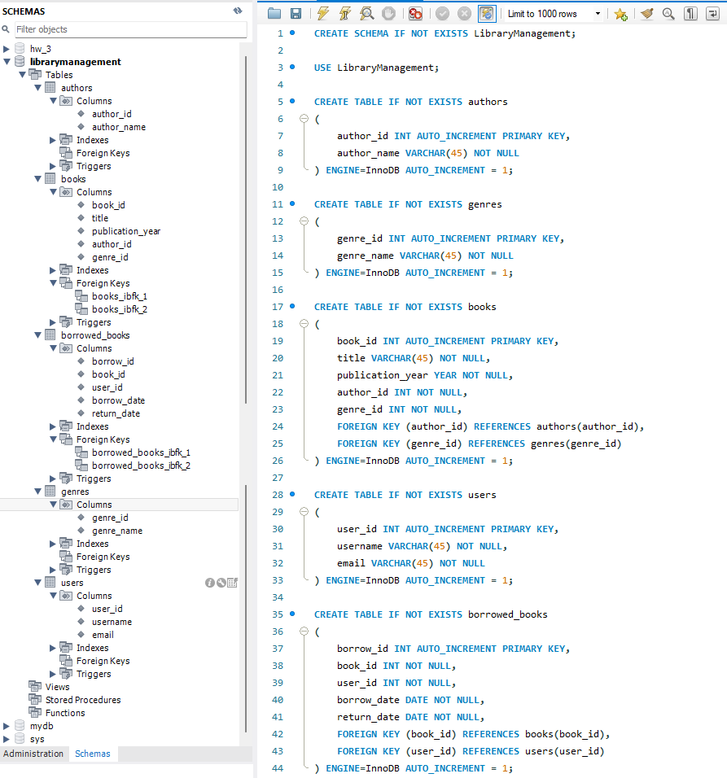
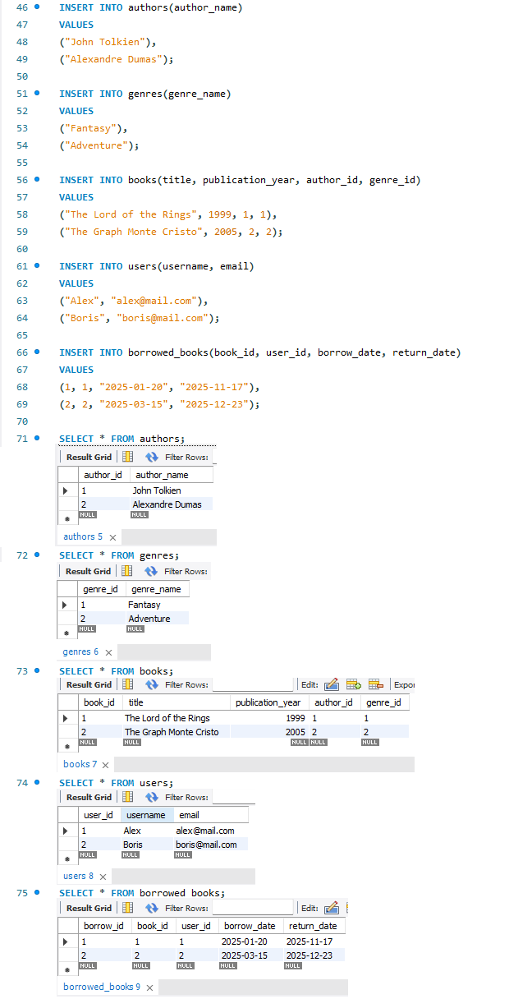
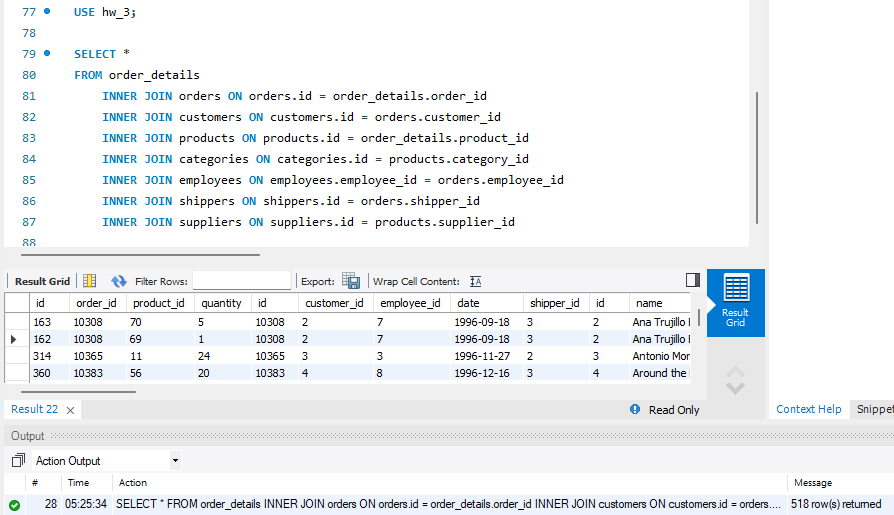
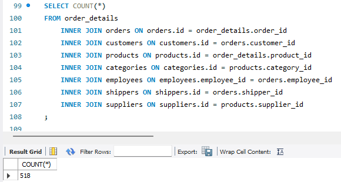
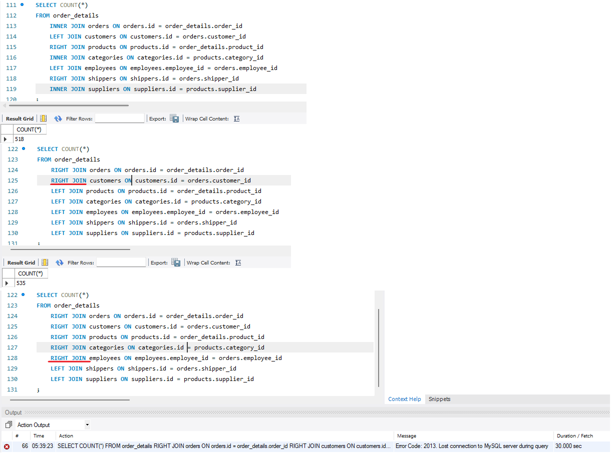
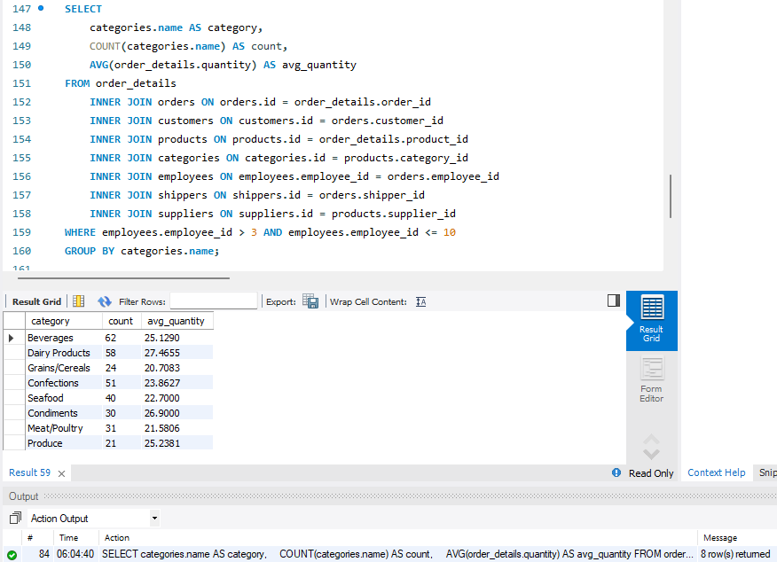
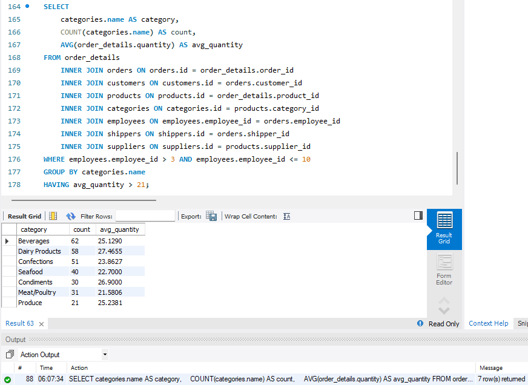
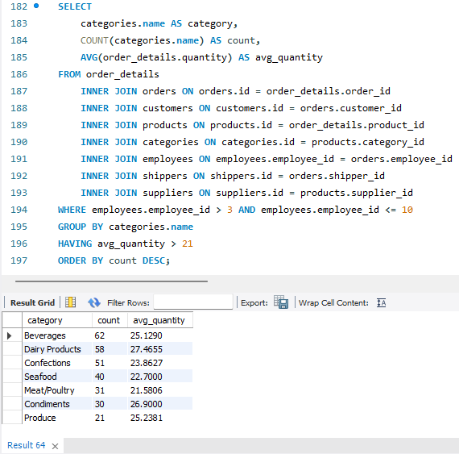
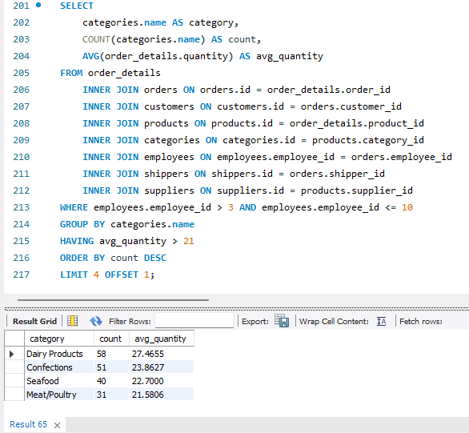

# Тема 4. DML та DDL команди. Складні SQL вирази

## 1. Створіть базу даних для керування бібліотекою книг згідно зі структурою, наведеною нижче. Використовуйте DDL-команди для створення необхідних таблиць та їх зв'язкі

### Структура БД

```
a) Назва схеми — “LibraryManagement”

b) Таблиця "authors":

- author_id (INT, автоматично зростаючий PRIMARY KEY)
- author_name (VARCHAR)

c) Таблиця "genres":

- genre_id (INT, автоматично зростаючий PRIMARY KEY)
- genre_name (VARCHAR)

d) Таблиця "books":

- book_id (INT, автоматично зростаючий PRIMARY KEY)
- title (VARCHAR)
- publication_year (YEAR)
- author_id (INT, FOREIGN KEY зв'язок з "Authors")
- genre_id (INT, FOREIGN KEY зв'язок з "Genres")

e) Таблиця "users":

- user_id (INT, автоматично зростаючий PRIMARY KEY)
- username (VARCHAR)
- email (VARCHAR)

f) Таблиця "borrowed_books":

- borrow_id (INT, автоматично зростаючий PRIMARY KEY)
- book_id (INT, FOREIGN KEY зв'язок з "Books")
- user_id (INT, FOREIGN KEY зв'язок з "Users")
- borrow_date (DATE)
- return_date (DATE)
```



## 2. Заповніть таблиці простими видуманими тестовими даними. Достатньо одного-двох рядків у кожну таблицю.



## 3. Перейдіть до бази даних, з якою працювали у темі 3. Напишіть запит за допомогою операторів FROM та INNER JOIN, що об’єднує всі таблиці даних, які ми завантажили з файлів: order_details, orders, customers, products, categories, employees, shippers, suppliers. Для цього ви маєте знайти спільні ключі.



## 4. Виконайте запити, перелічені нижче.

### Визначте, скільки рядків ви отримали (за допомогою оператора COUNT).



### Змініть декілька операторів INNER на LEFT чи RIGHT. Визначте, що відбувається з кількістю рядків. Чому? Напишіть відповідь у текстовому файлі.

Як бачимо нижче, При використанні **`LEFT JOIN`** результат не зміюється та ми отримуємо все ті ж 518 рядків. Проте використання **`RIGHT JOIN`** прихводить як до зміни результату у 535 рядків, так і до "зависання" розрахунку із викиданням помилки.

Це обмуовлене тим, що при зміні методу ми не змінюємо основну таблицю. Так при використанні **`INNER JOIN`** та **`LEFT JOIN`** у нас кожний рядок з лівої таблиці має відповідний рядок в правій таблиці і в нас відсутні "втрачені" або "додаткові" значення. А **`RIGHT JOIN`** при незмінній структурі запиту в порядку зверненні до таблиць. І ми отримуємо в якійсь з таблиць "справа" записи, якім немає відповідностей "зліва", що призводить до додавання рядків у результат.



### На основі запита з пункта 3 виконайте наступне: оберіть тільки ті рядки, де employee_id > 3 та ≤ 10.


### Згрупуйте за іменем категорії, порахуйте кількість рядків у групі, середню кількість товару (кількість товару знаходиться в order_details.quantity)



### Відфільтруйте рядки, де середня кількість товару більша за 21.



### Відсортуйте рядки за спаданням кількості рядків.



### Виведіть на екран (оберіть) чотири рядки з пропущеним першим рядком.


